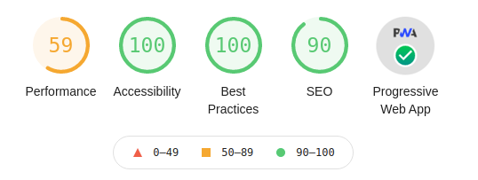

<p align="center">
  <a href="" target="blank"></a>
</p>

# Spletno programiranje 2021/2022

Lastni projekt pri predmetu **Spletno programiranje** v študijskem letu **2021/2022**.

## 1. LP

Osnutek aplikacije in wireframe model

### JobHub - _a simple swipe to get a job_

Naš prijatelj Arhur Dent je pravkar končal študij računalništva na eni izmed najbolj elitnih fakultet v celotni galaksiji. Glede na to, da trenutno živi še pri mami, se je odločil, da si bo kar se da hitro in enostavno poiskal službo kot razvijalec celostnih spletnih aplikacij. V galaksiji je ravno zdaj velik trend razvoja splentih aplikacij, zato je povpraševanja za delovno mesto, ki ga išče Arthur, ogrmono. Arhur se odloči, da bo za delovne ponudbe preveril na galaktično znani spletni aplikaciji LinkedOut. Ker je aplikacija LinkedOut sčasoma postala zelo kompleksna in podobna še eni galaktično znani aplikaciji Facelist, ga iskanje do službe kar hitro mine. Kot ponavadi je Arthur storil to, kar vedno naredi, ko mu je dolgčas. Na svojem mobilnem galaktifonu je odprl aplikacjio Tindre in začel izbirati s katerimi galaktičnimi bitji bi se rad spoznal. Ko vidimo, kako naš prijatelj Arthur izgublja motivacijo do iskanja nove službe, predvsem zaradi preprostega "swipanja" galaktičnih bitij, mu z največjim veseljem predstavimo revolucionarno galaktnično aplikacijo za preprosto iskanje zaposlitve, in sicer aplikacijo JobHub.

O aplikaciji JobHub: _JobHub je aplikacija za iskanje različnih zaposlitev, ne le za galaktična bitja, ki zaposlitev iščejo, ampak tudi za vsa mikroskopsko mala ali pa teraskopsko velika podjetja, ki delavce iščejo. Aplikacja JobHub je v četrti galaksiji, imenovani SP-2021/2022, popularna ravno zaradi svoje preprostosti. Filtriranje med raznimi razpisi za delo in bitji, ki se na posamezen razpis prijavijo, poteka s pomočjo izredno preprostega mehanizma, in sicer "swipanja"._

Naš prijatelj Arthur se je preko omenjene aplikacije s preprostim "swipom" prijavil za razpis v tehnološkem podjetju Netflex. Podjetje Netflex za iskanje novih delavcev uporabalja apliakcijo JobHob že od samega začetka. Všeč jim je preprostost kreiranja novega razpisa za iskanje delovnega mesta za neko pozicijo ter filtriranja med vsemi prijavljenimi kandidati s preprostim "swipanjem". Na seznamu prijavljenih kandidatov se je s "swipom v desno" našel tudi naš prijatelj Arthur. Oseba, zaposlena v kadrovski službi podjetja Netflex, je bila navdušena nad Arthurjevim življenjepisem, zato je s "swipom v desno" potrdila njegovo prijavo in mu poslala datum, kdaj naj se udeleži ragovora za službo.

Arthur je na razgovoru preprosto raztural in zato na izredno preprost način dobil službo v podjetju, za katerega si je želel delati že od malih nog.

### Opis za Zemljane

Spletna aplikacija JobHub je namenjena ponudnikom IN iskalcem različnih zaposlitev. Za lažje razumevanje bomo najprej opisali delovanje aplikacije s strani uporabnika, torej iskalca zaposlitve, in nato še s strani podjetja, torej ponudnika zaposlitve.

Uporabnik mora pred prvo uporabo aplikacije kreirati svoj profil, katerega bistvo je, da vsebuje njegove življenjske podatke, kontaktne podatke, življenjepis ter področja, na katerih se želi zaposliti. Svoje podatke uporabnik lahko spreminja na strani Profile. Glavna funkcionalnost strani je, da uporabnik s preprostim mehanizmom "swipanja" izbira med opisi delovnih mest za področje, ki ga je izbral v nastavitvah profila. "Swipe v desno" pomeni, da uporabnika dano delovno mesto zanima in se želi prijaviti na razgovor za delo, "swipe v levo" pa pomeni, da dana ponudba dela ni namenjena uporabniku in se na razgovor za delo ne želi prijaviti. Uporabniku aplikacija omogoča tudi tekstovno komunikacijo s podjetji, ki so sprejela njegovo prijavo na razpisano delovno mesto. Tako se uporabnik lahko s podjetjem dogovori o nadaljnjih informacijah glede samega razgovora za delo.

Tako kot uporabnik mora tudi podjetje pred svojo prvo uporabo aplikacije kreirati svoj profil, kjer navedejo svoje podatke in področja zaposlovanja. Aplikacija nato podjetju omogoča kreiranje razpisov za nova delovna mesta, ki so nato predstavljena uporabnikom, ki iščejo zaposlitev na danem področju. Ko se razpis za delovno mesto konča, se podjetju prikaže seznam življenjepisov uporabnikov, ki so se na to delovno mesto prijavli. Podjetje lahko filtrira med uporabniki, ki so se na razpis prijavili. "Swipe v desno" pomeni, da se podjetju oseba zdi interesantna in si želijo, da se udeleži razgovora za delovno mesto, "swipe v levo" pa pomeni, da podjetje žal ne želi dodatnega razgovora z dano osebo. Med osebami, ki jih je podjetje izbralo kot primerne za razpisano delovno mesto, in podjetjem zdaj aplikacija omogoča komunikacijo z namenom, da se podrobneje dogovorijo o delovnem mestu in možnem razgovoru.

[_Naslovna stran_](./docs/pages/index.html) predstavlja prvi stik aplikacije z uporabnikom. Na strani se je možno neposredno prijaviti v aplikacijo ali pa si ogledati zanimive podatke o različnih delovnih mestih, plačah, tehnologijah, ki se uporabljajo, itd.

[_Prijavna stran_](./docs/pages/sign-in/sign-in.html) omogoča uporanbiku vpis v aplikacijo. Prav tako aplikacija ponuja, da se uporabnik v aplikacijo vpiše z uporabniškim računom, ki ga uporablja že pri kateri drugi aplikaciji.

[_Stran za registracijo_](./docs/pages/sign-up/sign-up.html) omogoča kreiranje novega uporabnika ali podjetja v aplikacijo. Prvotna registracija uporabnika oziroma podjetja ni celostna. Uporabnik mora pred uporabo aplikacije vnesti svoj življenjepis, podjetje pa mora razpisati vsaj eno novo delovno mesto.

[_Glavna stran_](./README.md) ([stran](./docs/pages/main/user-main.html) za uporabnike in [stran](./docs/pages/main/company-main.html) za podjetja) uporabniku prikazuje življenjepise (v primeru, ko je uporabnik podjetje) in ponudbe za delo (v primeru, ko je uporabnik fizična oseba, ki išče delo). Uporabnik nato podrsne v desno, ko sprejme ponudbe in v levo, ko te ne sprejme. Na napravah z večjimi zasloni lahko uporabnik tudi klikne na gumb za sprejetje ali zavrnitev ponudbe. Če uporabnik sprejme ponudbo za delo in podjetje sprejme uporabnikov življenjepis, to imenujemo ujemanje.

<!---
[_Uporabnikova komunikacijska stran_](./docs/pages/user-message/user-message.html) omogoča komunikacijo med uporabnikom in podjetji. Na levi strani okna je prikazan seznam vseh ponudb za delo, s katerimi se je uporabnik "ujel". Po njih lahko iščemo s pomočjo iskalnega niza na vrhu okna. Na desni strani pa je prikazana vsa zgodovina komunikacije s posameznim podjetjem za določeno ponudbo za delo. Poleg osnovne tekstovne komunikacije je omogočeno tudi pošiljanje slik ter dokumentov. Stran omogoča tudi zapis in branje sporočil na oziroma iz verige blokov (DApps).

[_Komunikacijska stran podjetja_](./docs/pages/company-message/company-message.html) omogoča komunikacijo med podjetjem in uporabniki. Na levi strani okna je prikazan seznam vseh "ujemanj", po katerih lahko iščemo s pomočjo iskalnega niza na vrhu okna. Na desni strani pa je prikazana vsa zgodovina komunikacije s posameznim uporabnikom, vidnim na vrhu okna. Poleg osnovne tekstovne komunikacije je omogočeno tudi pošiljanje slik ter dokumentov. Stran omogoča tudi zapis in branje sporočil na oziroma iz verige blokov (DApps).
--->

[_Profilna stran uporabnika_](./docs/pages/user-profile/user-profile.html) uporabniku spletne aplikacije omogoča spreminjanje svojega uporabniškega profila. Uporabnik lahko spremeni svoje osebne podatke, email, leto rojstva, telefonsko številko in svoje geslo. Uporabnik lahko napiše tudi svoj kratek opis, svoje izkušnje, ureja pa lahko tudi svoj življenjepis, ki je pogoj za uporabo aplikacije. Aplikacija omogoča tudi spreminjanje svoje profilne slike.

[_Profilna stran podjetja_](./docs/pages/company-profile/company-profile.html) podjetju spletne aplikacije omogoča spreminjanje svojih osnovnih podatkov in zamenjavo gesla. Na oknu je tudi gumb, ki omogoča, da podjetje doda nov razpis za delo. Na strani se tudi prikaže seznam (master/detail vzorec) vseh aktivnih ponudb za delo, ki jih je mogoče urejati, pregledati statistiko prijav in izbrisati.

[_Predogled življenjepisa_](./docs/pages/preview/resume-preview.html) se uporabi, ko uporabnik želi spreminjati svoj življenjepis. Ta ga lahko istočasno ureja in vidi, kako bo življenjepis prikazan na glavni strani. Predogled življenjepisa se dinamično spreminja medtem, ko uporabnik spreminja podatke v vnosnih poljih. Podatki se avtomatsko tudi shranjujejo.
Stran omogoča tudi zapis in branje življenjepisov na oziroma iz verige blokov (DApps).

[_Predogled ponudbe za delo_](./docs/pages/preview/job-offer-preview.html) deluje enako kot predogled življenjepisa, le da se ga uporablja, ko podjetje želi dodajati nove ponudbe za delo. Stran omogoča tudi zapis in branje ponudb za delo na oziroma iz verige blokov (DApps).

[_Administatorjeva stran_](./docs/pages/admin-dashboard/admin-dashboard.html) je stan, ki jo admin uporablja za nadzorovanje spletne aplikacije.
Omogoča pregled uporabnikov in podjetij. Prav tako omogoča pregled, urejanje in brisanje življenjepisov ter ponudb za službo.

[_Prijavna stran za administratorja_](./docs/pages/admin-sign-in/admin-sign-in.html) omogoča prijavo v sistem administratorju. Ta ima pregled nad vsemi uporabniki in podjetji.

[_404 stran_](./docs/pages/error/404.html) je stran, ki se prikaže, ko stran, ki jo je uporabnik iskal, ne obstaja.

[_502 stran_](./docs/pages/error/502.html) je stran, ki se prikaže, ko pride do napake na strežniku.

## 2. LP

Dinamična spletna aplikacija z logiko na strani strežnika in povezovanje na podatkovno bazo.

### Priročnik za uporabo

```bash
# namesttev odvisnih knjižnic
$ npm install
# zagon aplikacije v dockerju
$ docker-compose up
# zagon aplikacije
$ npm run start
# vnos testnih primerov
$ npm run seed
```

### Namestitev

```bash
# namestitev odvisnih knjižnic
$ npm install
```

### Zagon aplikacije

```bash
# zagon aplikacije
$ npm run start

# zagon aplikacije v opazovalnem načinu
$ npm run start:dev
```

### Uporabni ukazi

```bash
# izgradnja aplikacije
$ npm run build

# ponastavitev aplikacije in baze
$ npm run reset

# zagon aplikacije v dockerju
$ npm run docker:up

# ustavitev aplikacije v dockerju
$ npm run docker:down

# izbris aplikacije v dockerju
$ npm run docker:remove

# povezava do baze (docker)
$ npm run docker:connect-db

# vnos podatkov v bazo (docker)
$ npm run docker:data-insert

# izpis podatkov iz baze (docker)
$ npm run docker:data-find

# izbris podatkov iz baze (docker)
$ npm run docker:data-remove

# vnos testnih primerov
$ npm run seed

# formatiranje
$ npm run format

# sintaktična analiza
$ npm run lint
```

### Dodatne informacije

**_npm_** version: **>= 8.1.0**

**_node_** version: **>= 16.9.0**

### Dodatna knjižnica: dotenv

[dotenv](https://www.npmjs.com/package/dotenv) je knjižnica, ki nam omogoči nalaganje spremenljivk iz okolja datoteke **.env** v okolje **proccess.env**. Shranjevanje konfiguracije v okolju ločeno od kode temelji na metodologiji aplikacije Twelve-Factor App. Knjižnico smo v našem projektu uporabili tako, da smo vanjo zapisalli okoljske spremenljivke in njihove vrednosti, ki smo jih nato uporabili v aplikaciji. Za primer predstavitve vseh spremenljivk brez njihovih dejanskih vrendosti smo naredili tudi datoteko **.example.env**.

Namestitev knjižnice: `npm install dotenv`

Uporaba knjižnice: `require('dotenv').config()`

Dadoteki _.env_, ki se nahaja v korenskem imeniku naše aplikacije, dodamo novo okoljsko spremenlivko v obliki _IME=VREDNOST_. Na primer `PROJECT_NAME=jobhub`.

### Vnosna polja

Spletna aplikacija vsebuje več tipov različnih vnosnih polj, ki vsebujejo omejitve glede tipa vnosa zaradi skladnosti podatkov. Na začetni strani imamo vnosno polje za vnos email naslova in pa gelsa (geslo mora vsebovati vsaj 7 znakov, od tega vsaj eno veliko črko in vsaj eno številko). Prijavna stran prav tako vsebuje enaka vnosna polja. Stran za registracijo novega uporabnika vsebuje še dodatna vnosa polja poleg vnosnih polj, ki smo jih opisali pri naslovni strani. Dodatna polja omogočajo vnos imena novega uporabnika ter industrijo v kateri se želi zaposliti. Obe vnosni polji dovoljujeta le črke (male in velike). Uporabnikova profilna strain in profilna stran podjetja sta si po tipih vnosnih polj zelo podobni. Obe vsebujeta vnosna polja za vnos imen, torej polja, ki dovoljujejo vnos le črk (malih in velikih), vnos elektronskega naslova, ki dovoljuje vnos le niza znakov, ki ustrezajo osnovnim pogojem oblike elektronskega naslova. Sledi vnosno polje za izbiro spola, to je le polje, ki omogoča izbiro med moškim, ženskim in ostalim spolom. Naslednje vnosno polje je polje za vnos datuma, polje dovoljuje le niz v obliki datuma (YYYY-MM-DD). Vnosno polje za vnos telefonske štefilke, dovojluje le vnos nizov oblike +DDD-DD-DDD-DDD. Vnosni polji za izbiro industrije dela in države uporabnika sta zelo podobni, omogoča le izbiro iz že vnaprej podanega seznama. Sledita še vnosni polji za posodobitev gesla (geslo mora vsebovati vsaj 7 znakov, od tega vsaj eno veliko črko in vsaj eno številko, obe vnosni polji morata sprejeti enak niz).

### Naprave

Aplikacija deluje na **telefonih**, **tablicah** in **računalnikih** poljubne velikosti.

### Heroku

Delujoča aplikacija je dostopna tudi na [Heroku](https://jobhub-sp.herokuapp.com/).

### Zunanji vir

Kot primarni zunanji vir smo uporabili javni api [JokesAPI](https://jokes.one/api/joke/) za generiranje dnevnih vicev. Podatke iz omenjenega apija uporabljamo na začetni strani v modalnem oknu, z namenom še dodatne sprostitve uporabnika in posledično zanj še boljše uporabniške izkušnje naše aplikacije.
Kot dodaten zunanji vir za prikaz statističnih podatkov glede plač, uporabljenih tehnologij in dela slovenskih razvijalcev programske opreme smo uporabili spletno stran [SmartNinja](https://www.smartninja.si).

## 3. LP

SPA aplikacija na eni strani.

### Priročnik za uporabo

```bash
# namesttev odvisnih knjižnic
$ npm install
# zagon aplikacije
$ ng serve
# testiranje aplikacije
$ ng test
# dodatna pomoč
$ ng help
```

### Namestitev

```bash
# namestitev odvisnih knjižnic
$ npm install
```

### Zagon aplikacije

```bash
# zagon aplikacije
$ ng serve
# zagon aplikacije v opazovalnem načinu
$ ng serve --open
```

### Uporabni ukazi

```bash
# izgradnja aplikacije
$ ng build
# testiranje aplikacije
$ ng test
# dodatna pomoč
$ ng help
# formatiranje
$ npm run format
# sintaktična analiza
$ npm run lint
```

### Heroku

Delujoča aplikacija je dostopna tudi na [Heroku](https://jobhub-sp.herokuapp.com/).

## 4. LP

Varnostno zaščitena progresivna in porazdeljena aplikacija.

# Tipi uporabnikov

Spletna aplikacija JobHub ima 4 tipe uporabnikov, in sicer: **guest**, **user**, **company** in **admin**. Uporabnik tipa _guest_ je uporabnik, ki v aplikacijo ni prijavljen in posledično nima pravic za uporabo aplikacije. Dostopa lahko le do glavne strani, kar pomeni, da se lahko v aplikacijo registrira oziroma vpiše, če je že registriran. Prav tako ima pregled nad prikazom vseh grafov glede zaposlitev in uporabljenih tehnologij slovenskih razvijalcev programske opreme. Uporabnika tipa _user_ in _company_ sta zelo podobna in predstavljata glavni člen uporabe naše aplikacije. Oba uporabnika si lahko urejata svoj profil ter swipata med različnimi ponudbami za delo oziroma življenjepisi. Uporabnik tipa user lahko na aplikacijo naloži svoj življenjepis in se s pomočjo mehanizma swipapnja prijavlja na različne ponudbe za delo na področju za katerega se zanima. Uporabnik tipa company lahko na aplikacijo dodaja ponudbe za delo na področju za katerega išče zaposlitev in izbira s pomočjo swipanja med različnimi življenjepisi uporabnikov, ki so se na dano ponudbo za delo prijavili. Zadnji tip uporabnika je uporabnik tipa admin, gre pravzaprav za sistemskega administratorja, ki ima vse možne pravice. Lahko vidi kateri uporabniki so v aplikaciji registrirani, njihove osnovne podatke, življenjepise oz ponudbe za delo, itd. Uporabnik tipa admin lahko tudi izbriše ali uredi poljubnega uporabnika ali njegov življenjepis oziroma ponudbo za delo. Administrator ima prav tako moč počistiti bazo, jo ponastaviti ali pa napolniti s testnimi primeri.

# Progresivna spletna aplikacija

Spodaj je prikazan razultat kakovosti spletne aplikacije JobHub s pomočjo orodja Lighthouse.


# Dokumentacija REST API vmesnika

Dokumentacija za REST API vmesnik, ki se uporablja v spletni aplikaciji JobHub je navoljo na [docs](https://jobhub-sp.herokuapp.com/docs).

# Varnostni pregled

Poročilo varnostnega pregleda spletne aplikacije JobHub, narejeno z ogrodjem [OWASP ZAP](https://owasp.org/www-project-zap/) se nahaja v imeniku _/test_.

### Avtorji

- [Miha Godec](https://github.com/mih4god3c)
- [Rok Mokotar](https://github.com/mokot)
- [Vid Potočnik](https://github.com/potocnikvid)
- [David Preininger](https://github.com/Davaxis)
- [Timotej Zupančič](https://github.com/SuprchargdV8)

### Licenca

jobhub je [ZAPRT](LICENSE)
